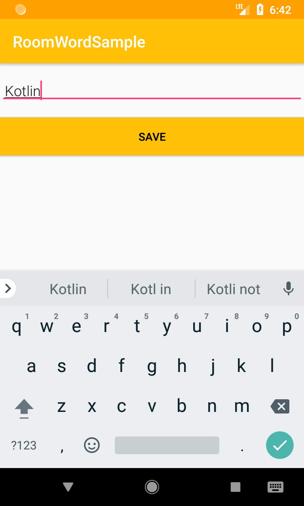

## Introduction

A basic Android app built using Android Architecture Components and Room library to store user entered words and display them in a `RecyclerView`.
 
 The following are primarily used:
 
 - LiveData
 - ViewModel
 - Room
 - Repository
 
 ## Screenshots
 
       
